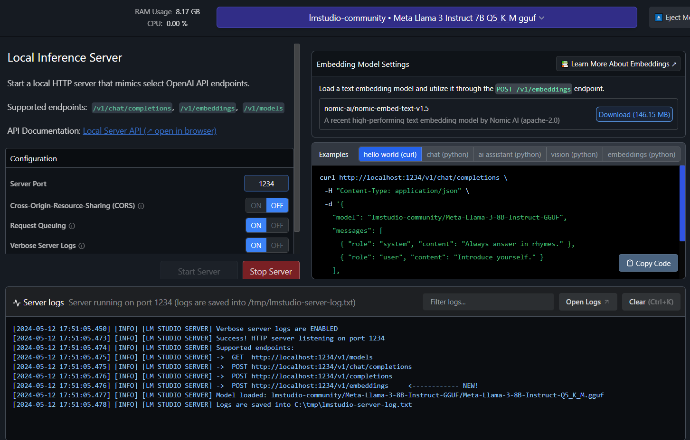

# Aplicativo Assistente de IA


[](./LICENSE)

Este projeto é uma API construída utilizando **Java, Java Spring, Langchain4j e LM Studio.**

## Sumário

- [Instalação](#instalação)
- [Uso](#uso)
- [Endpoints da API](#endpoints-da-api)
- [Contribuições](#contribuições)

## Instalação

1. Clone o repositório:

```bash
git clone https://github.com/JU7I0/ai-assistant-java.git
```

2. Instale as dependências com o Maven

## Uso

1. Inicie a aplicação com o Maven
2. A API estará acessível em http://localhost:8080
3. Instale [LM Studio](https://lmstudio.ai/)
4. Faça o download do modelo Meta-Llama-3-8B-Instruct-Q5_K_M.gguf
5. Inicie o Servidor LM



## Endpoints da API
A API fornece os seguintes endpoints:

**METODO POST**
```markdown
POST /api/chat - Faça perguntas ao chat.
```
```json
{
    "message": "Oi, tudo bem?"
}
```
```json
{
  "response": "Tudo bem! Como posso ajudar você hoje?"
}
```

## Contribuições

Contribuições são bem-vindas! Se você encontrar algum problema ou tiver sugestões para melhorias, por favor, abra uma issue ou envie um pull request para o repositório.

Ao contribuir para este projeto, por favor, siga o estilo de código existente, [convenções de commits](https://www.conventionalcommits.org/en/v1.0.0/), e envie suas alterações em um branch separado.
